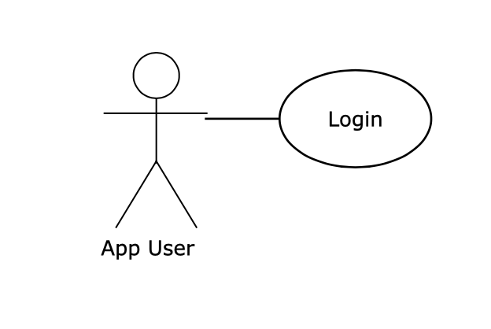

# Use Case Diagram Exercise

The file, UseCaseDiagram.md, contains a list of user stories in the form:

\# Title  
\#\# Description  
yuml.me Use Case Diagram syntax

The first one is completed for you.

1. Go to yuml.me and create a Use Case diagram. You do not need an account.
2. Copy and paste the contents of the file UseCaseDiagram.md into the editor on the left of the screen.
3. You should then see the following on the right:

4. Fill in the rest of the yuml syntax needed to fit all the user stories into use case syntax. I.e., follow the first example.

5. For each use case that you add, commit to your exercise repository with an appropriate commit comment. Note: You can do this directly on GitHub. You do not have to clone the repository.

6. Do one conversion at a time. Note that these user stories fit directly into a single use case. This is **not** always the case. Also, we only have the use case diagram, not the use case text, which would contain much more written detail.
